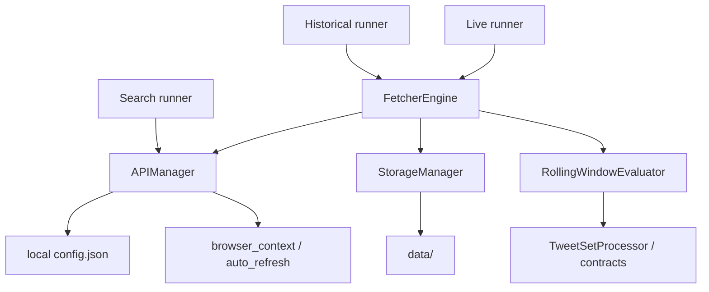

# TWEETER DATA FETCHER — Agent Guide

This is the canonical handoff file for coding agents. Read this before touching the repo.

## Current Project State

Latest update: July 2026.

The active codebase is the root-level `src/` project. Older source trees live under `LEGACY/` as archive material. Runtime data, graph output, local credentials, probe output, and sniffer captures are ignored.

Core outcome of the latest work:

- Historical and live pipelines are unified around `FetcherEngine`, `StorageManager`, and `RollingWindowEvaluator`.
- Historical and live use global two-pass endpoint order: all due `UserTweets`, then all due `UserTweetsAndReplies`.
- Rolling windows are timestamp-granular and watermark-backed.
- Profile processed output has 7 sets.
- Query IDs and transaction IDs are endpoint-specific pools with 3-strike failure state.
- Rate-limit sleeps follow `x-rate-limit-reset` plus safety buffer, capped at 3600 seconds.

## Quick Navigation

| Component | Main Files |
|---|---|
| Historical pipeline | `src/pipelines/historical/fetch_historical.py` |
| Live pipeline | `src/pipelines/live/monitor_live.py`, `src/pipelines/live/utils.py` |
| Search pipeline | `src/pipelines/search/search_timeline.py` |
| HTTP/auth/rate limits | `src/shared/core/twitter_http_client.py` |
| Pagination/window stop | `src/shared/core/pagination_engine.py` |
| Tweet parsing/set math/contracts | `src/shared/core/tweet_processing_utils.py` |
| Storage/state/reports | `src/shared/data_pipeline/storage_manager.py` |
| Browser/bootstrap/refresh | `src/shared/auth/browser_context.py`, `src/shared/auth/auto_refresh.py` |
| Account/search config | `src/shared/config/account_tiers.py`, `src/shared/config/search_config.json` |
| Safe config template | `src/shared/config/config.example.json` |
| Tests | `tests/unit/`, `tests/integration/`, `tests/contract/` |

## Non-Negotiables

- Do not commit `src/shared/config/config.json`; it contains live cookies/tokens.
- Do not commit `data/`, `diagnostics/probe_runs/`, `diagnostics/sniffer_runs/`, `diagnostics/graphql_logs/`, or `graphify-out/`.
- Prefer root-cause fixes in shared code over one-off guards in pipeline runners.
- Keep Twitter/X request-shape changes evidence-backed by sniffer/probe output.
- Do not add generalized request abstractions unless multiple current callers require them.
- After meaningful code changes run `.venv/bin/python -m pytest -q`.
- After code changes that alter architecture, refresh graphify with `graphify update .`.

## How To Run

```bash
source .venv/bin/activate

python -m src.pipelines.historical.fetch_historical --only elonmusk
python -m src.pipelines.live.monitor_live --account elonmusk --once
python -m src.pipelines.search.search_timeline --once

.venv/bin/python -m pytest -q
```

First-time local auth:

```bash
cp src/shared/config/config.example.json src/shared/config/config.json
python src/shared/auth/auto_refresh.py --interactive
```

## Architecture



Historical and live share:

- `data/historical_live/raw/UserTweets/`
- `data/historical_live/raw/UserTweetsAndReplies/`
- `data/historical_live/processed/`
- `data/historical_live/state/sync_state.json`

Live additionally owns:

- `data/historical_live/state/live_state.json`
- `data/historical_live/state/seen_tweets.json`
- `data/historical_live/state/snapshot_index.json`
- `data/historical_live/viral/`

Search is isolated under `data/search/` and must not create historical/live set folders.

## Rolling Window Contract

The shared cutoff rule is:

```text
effective_cutoff = min(now - configured_window, floor(fetch_watermark))
```

- Historical uses `historical_window_days` and floors watermark to day start.
- Live uses `live_window_hours` and floors watermark to hour start.
- `fetch_watermark` advances only after successful endpoint completion.
- Partial/failed runs do not advance the watermark.
- Overlap is expected; dedup absorbs it.

Default windows by priority:

| Priority | 1 | 2 | 3 | 4 | 5 | 6 | 7 |
|---|---:|---:|---:|---:|---:|---:|---:|
| live hours | 24 | 20 | 16 | 12 | 9 | 6 | 3 |
| historical days | 7 | 6 | 5 | 4 | 3 | 2 | 2 |

## Endpoint Order

Historical and live use global two-pass order:

1. Resolve user IDs for active/due accounts.
2. Fetch `UserTweets` for every account in tier order.
3. Fetch `UserTweetsAndReplies` for every account in tier order.
4. Build processed sets per account.

This keeps endpoint rate-limit windows independent and makes pipeline behavior consistent.

## Processed Output Sets

Let `A = UserTweets` and `B = UserTweetsAndReplies`.

| Folder | Set |
|---|---|
| `1_user_tweets` | `A` |
| `2_user_tweets_and_replies` | `B` |
| `3_intersection` | `A ∩ B` |
| `4_union` | `A ∪ B` |
| `5_a_minus_b` | `A - B` |
| `6_b_minus_a` | `B - A` |
| `7_symmetric_difference` | `A △ B` |

`StorageManager.merge_processed_items()` dedups by `author_id:tweet_id` when possible, otherwise tweet ID.

Legacy `5_replies_only` is treated as `6_b_minus_a` for backward compatibility.

## Auth And Request Parameters

`APIManager` owns auth/session/rate-limit state.

Local config:

- `api_cookies`: `auth_token`, `ct0`, `guest_id`, `kdt`, `twid`, etc.
- `api_auth.bearer_token`: public web bearer token.
- `api_config`: current scalar query IDs.
- `query_ids_by_endpoint`: query-id pools.
- `real_transaction_ids_by_endpoint`: tx-id pools.
- `anti_bot_simulation.error_retry_policy.max_rate_limit_sleep_seconds`: default `3600`.

State files:

- `tx_id_state.json`: tx-id health and failure count.
- `query_id_state.json`: query-id health and failure count.
- `rate_limits.json`: endpoint rate-limit reset/remaining state.
- `endpoint_health.json`: endpoint-level health classification.

Rule-out policy:

- A tx-id or query-id is marked suspect for the first two 404 failures.
- It is ruled out on the third consecutive failure.
- A 200 marks the value healthy and resets its failure count.
- Auto-refresh triggers after 3 endpoint-level consecutive 404s when tx-id or query-id candidates are exhausted.

## GraphQL Request Contract

Runtime endpoints:

| Endpoint | Runtime referer | Core variables |
|---|---|---|
| `UserByScreenName` | `https://x.com/{username}` | `screen_name`, `withGrokTranslatedBio` |
| `UserTweets` | `https://x.com/{username}` | `userId`, `count: 20`, optional `cursor`, promoted content, quick-promote fields, voice |
| `UserTweetsAndReplies` | `https://x.com/{username}/with_replies` | `userId`, `count: 20`, optional `cursor`, promoted content, community, voice |
| `SearchTimeline` | `https://x.com/search?...&src=typed_query` | `rawQuery`, `count: 20`, optional `cursor`, `querySource`, `product` |

Timeline rules:

- Use GET to `https://x.com/i/api/graphql/{query_id}/{endpoint}`.
- Use compact JSON query params for `variables`, `features`, and optional `fieldToggles`.
- `UserTweets` and `UserTweetsAndReplies` include `fieldToggles={"withArticlePlainText":false}`.
- `SearchTimeline` omits `fieldToggles`.
- Extract only bottom cursors from timeline instructions.
- Never reuse cursors across endpoint, account, query, product, or session.
- Validate HTTP status, JSON parse, GraphQL `errors`, endpoint data path, supported instruction types, and fresh bottom cursor independently.

## HTTP Failure Policy

| Status | Meaning | Action |
|---|---|---|
| 200 | Transport success | Validate GraphQL body before parsing. |
| 400 | Request contract/encoding failure | Do not retry unchanged request; compare query ID, variables, features, field toggles, compact JSON. |
| 401/403 | Auth/session failure | Refresh cookies/session; do not change pagination fields. |
| Initial 404 | Query/context/param rejection | Try browser/bootstrap once, then classify failure; param state may trigger auto-refresh. |
| Cursor 404 | Dead cursor | Preserve completed pages and stop chain as partial. |
| 429 | Rate limit | Sleep until reset epoch plus buffer, capped at 3600s, retry same cursor/page. |
| 5xx | Server failure | Exponential backoff per retry policy. |

## Storage Layout

```text
data/
  historical_live/
    raw/UserTweets/{account}/{batch}/page_N.json
    raw/UserTweetsAndReplies/{account}/{batch}/page_N.json
    processed/1_user_tweets/
    processed/2_user_tweets_and_replies/
    processed/3_intersection/
    processed/4_union/
    processed/5_a_minus_b/
    processed/6_b_minus_a/
    processed/7_symmetric_difference/
    reports/
    state/
    viral/
  search/
    raw/{search_slug}/{product}/{batch}/page_N.json
    processed/{search_slug}/{product}/
    debug/
    reports/
    state/search_state.json
```

## Common Tasks

Add or edit accounts:

- Edit `src/shared/config/account_tiers.py`.
- Keep priority tiers/account lists simple.
- `DEFAULT_PRIORITY_POLICIES` controls windows and poll intervals.

Add or edit searches:

- Edit `src/shared/config/search_config.json`.
- `product` must be `Top`, `Latest`, `Media`, or `People`.
- `preserve_exact_query: true` lets the raw query pass through unchanged.

Refresh auth/session:

```bash
python src/shared/auth/auto_refresh.py --interactive
```

Probe endpoints:

```bash
python diagnostics/probe_txid.py
python diagnostics/probe_sequence.py
python diagnostics/verify_contract.py
```

Use graphify:

```bash
graphify query "How do live and historical share StorageManager?"
graphify path "APIManager" "FetcherEngine"
graphify update .
```

## Tests

Current suite:

```bash
.venv/bin/python -m pytest -q
# 49 passed
```

Focused regression file:

```bash
.venv/bin/python -m pytest tests/unit/test_unified_historical_live_plan.py -q
```

That file covers:

- timestamp-granular cutoff completion,
- watermark floor gap prevention,
- 7 set operations,
- 3-strike param rule-out,
- 3600 second rate-limit cap.
