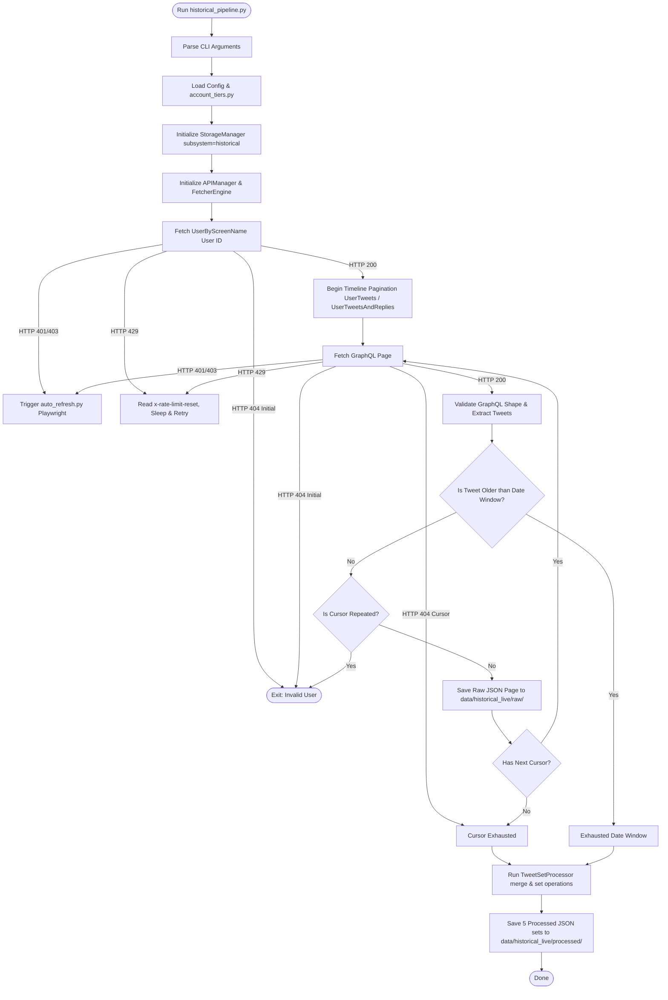
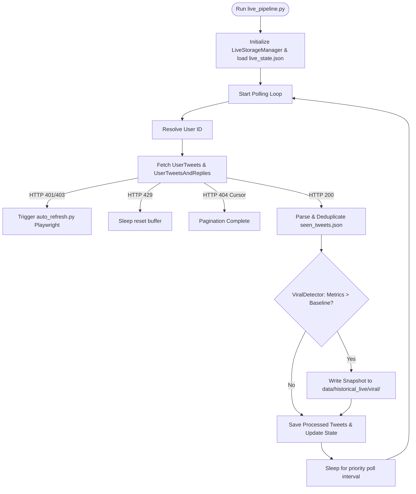
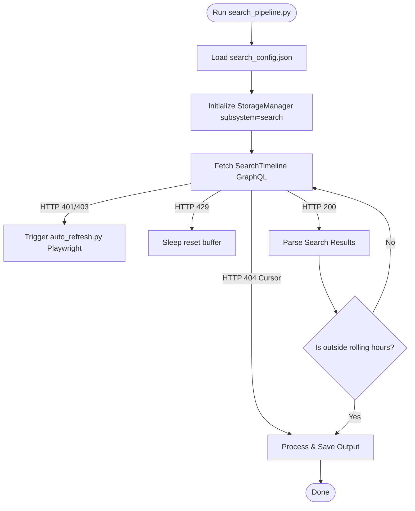

# TWEETER DATA FETCHING 4.0 — Project Index & Guide

> **Latest update (July 2026):** The 404 fix for UserTweetsAndReplies and SearchTimeline is now complete. The system uses **endpoint-specific real transaction IDs** captured from browser sessions, with **automatic refresh** via headless Playwright when all IDs expire. See [Twitter 404 Fix Architecture](#twitter-404-fix-architecture) below.

## Quick Navigation

| Component | Description | Main File(s) |
|-----------|-------------|--------------|
| **Historical** | Fetches tweets from historical timelines | `historical_scripts/historical_pipeline.py` |
| **Live** | Monitors live tweets with viral detection | `live_scripts/live_pipeline.py`, `live_scripts/live_utils.py` |
| **Search** | Advanced search timeline monitoring | `search_scripts/search_pipeline.py` |
| **Shared Core** | API manager, fetcher engine, utilities | `shared/core/*` |
| **Shared Storage** | Data persistence and state management | `shared/data_pipeline/storage_manager.py` |
| **Shared Config** | API keys, endpoints, tier configs | `shared/config/*` |
| **Auth & Sniffer** | Cookie setup, query-id refresh, traffic capture | `shared/auth/*` (incl. `graphql_traffic_sniffer.py`, `query_ids_updater.py`) |


---

## Twitter 404 Fix Architecture

### Problem Root Cause

Twitter's GraphQL API validates `x-client-transaction-id` headers against session context. The original code generated random 94-character IDs, which worked for `UserTweets` but caused persistent 404s for `UserTweetsAndReplies` and `SearchTimeline`.

**Key findings from controlled probes:**
- Same session, same cookies, same query-id → UserTweets returned 200, UserTweetsAndReplies returned 404
- Not caused by missing browser headers (tested with full header set)
- Transaction IDs are endpoint-specific and session-bound
- Browser captures showed 14+ unique real tx-ids, all exactly 94 characters

### Solution: Three-Layer System

#### Layer 1: Endpoint-Specific Transaction ID Pools

**File:** `shared/config/config.json`

```json
{
  "real_transaction_ids_by_endpoint": {
    "UserTweets": ["tx_id_1", "tx_id_2", ...],
    "UserTweetsAndReplies": ["tx_id_1", "tx_id_2", ...],
    "SearchTimeline": ["tx_id_1", "tx_id_2", ...],
    "UserByScreenName": ["tx_id_1", "tx_id_2", ...]
  }
}
```

Each endpoint maintains its own pool of real browser-captured transaction IDs. The system rotates through the pool on each request.

**Modified:** `shared/core/twitter_http_client.py`
- `__init__`: Loads endpoint-specific tx-id pools from config
- `_build_request_headers`: Selects next tx-id from the correct endpoint pool
- Fallback: Generates random 94-char ID if pool is empty (safety net)

#### Layer 2: Per-Transaction-ID State Tracking

**File:** `data/historical_live/state/tx_id_state.json`

```json
{
  "UserTweets": {
    "tx_id_abc123...": "healthy",
    "tx_id_def456...": "stale"
  },
  "UserTweetsAndReplies": { ... }
}
```

The system tracks health status for each tx-id:
- `healthy`: Last request returned HTTP 200
- `stale`: Last request returned HTTP 404

**Logic in `twitter_http_client.py`:**
1. On request: Skip stale tx-ids, rotate only through healthy ones
2. On 200 response: Mark current tx-id as `healthy`
3. On 404 response: Mark current tx-id as `stale`, increment consecutive 404 counter
4. If all tx-ids for an endpoint are stale → trigger auto-refresh

#### Layer 3: Automatic Refresh via Headless Playwright

**File:** `shared/auth/auto_refresh.py`

**Trigger condition:** 3 consecutive 404s **and** all tx-ids for that endpoint marked stale.

**Process:**
1. Launch headless Playwright browser
2. Navigate to target's profile (uses `elonmusk` by default)
3. Visit three sections with scrolling to trigger GraphQL requests:
   - Profile tweets page (3 scrolls) → captures UserTweets tx-ids
   - Replies page (`/with_replies`, 3 scrolls) → captures UserTweetsAndReplies tx-ids  
   - Search page (`?q=test&f=live`, 3 scrolls) → captures SearchTimeline tx-ids
4. Intercept all GraphQL requests, extract tx-ids by endpoint type
5. Update `config.json` with fresh endpoint-specific tx-ids
6. Reload config in main thread
7. Retry the failed request with fresh tx-id

**Files modified:**
- `shared/auth/auto_refresh.py` — New module (headless browser automation)
- `shared/core/twitter_http_client.py` — Auto-refresh trigger logic
- `shared/auth/query_ids_updater.py` — Enhanced to collect endpoint-specific tx-ids

### Testing & Validation

**Probe tool:** `tools/probe_txid.py`

Tests all three critical endpoints (UserTweets, UserTweetsAndReplies, SearchTimeline) using the current endpoint-specific tx-id system. Run after any auth changes:

```bash
cd "TWEETER DATA FETCHING 4.0"
python3 tools/probe_txid.py
```

**Expected output:**
```
[UserTweets/endpoint_specific] HTTP 200  rate-remaining=49
[UserTweetsAndReplies/endpoint_specific] HTTP 200  rate-remaining=149
[SearchTimeline/endpoint_specific] HTTP 200  rate-remaining=48
```

**Sequence probe:** `tools/probe_sequence.py` validates whether Twitter requires sequential requests (UserTweets before UserTweetsAndReplies). Current evidence shows this is **not** required.

### When Auto-Refresh Triggers

Monitor these signals in logs:

```
[WARNING] All transaction IDs stale for endpoint=UserTweetsAndReplies, triggering auto-refresh...
[INFO] Auto-refresh: Launching headless Playwright...
[INFO] Auto-refresh: Navigating to profile tweets...
[INFO] Auto-refresh: Captured 4 tx-ids for UserTweets
[INFO] Auto-refresh: Navigating to replies...
[INFO] Auto-refresh: Captured 5 tx-ids for UserTweetsAndReplies
[INFO] Auto-refresh: Config updated, reloading...
[INFO] Retrying request with fresh tx-id...
```

Auto-refresh adds 10-30 seconds latency when triggered, but is fully automated—no manual intervention needed.

### Manual Refresh (If Needed)

If auto-refresh fails or you want to pre-populate fresh tx-ids:

```bash
# Full browser-based refresh (captures tx-ids + query-ids + cookies)
python shared/auth/query_ids_updater.py

# Headless auto-refresh standalone test
python -c "from shared.auth.auto_refresh import auto_refresh_transaction_ids; auto_refresh_transaction_ids()"
```

### Key Evidence Files

Transaction IDs were originally extracted from these sniffer captures:
- `tests/sniffer_runs/1405-04-16_15-29/clean_timeline.jsonl` (5 UserTweetsAndReplies tx-ids)
- `tests/sniffer_runs/1405-04-14_15-20/clean_timeline.jsonl` (4 UserTweets tx-ids, 2 UserByScreenName tx-ids)

All captured tx-ids are exactly 94 characters, base64 URL-safe encoded. Browser generates a fresh tx-id for each GraphQL request—the system never reuses the same ID twice in succession during normal operation.

> **Knowledge graph:** a graphify graph lives at `../graphify-out/` (repo root). For codebase questions run
> `graphify query "<question>"`, `graphify path "<A>" "<B>"` for relationships, or `graphify explain "<concept>"`.
> After modifying code, refresh it from the repo root with `graphify update .` (AST-only, no API cost).

## Data Storage Layout

```
data/
├── historical_live/          # Historical + Live data (shared root)
│   ├── raw/
│   │   ├── UserTweets/
│   │   └── UserTweetsAndReplies/
│   ├── processed/
│   │   ├── 1_user_tweets/
│   │   ├── 2_user_tweets_and_replies/
│   │   ├── 3_intersection/
│   │   ├── 4_union/
│   │   └── 5_replies_only/
│   ├── reports/
│   ├── state/                # Contains sync_state.json (historical/live only)
│   └── viral/
│       ├── snapshots/
│       └── reports/
└── search/                   # Search data (isolated from historical)
    ├── raw/
    │   └── {search_slug}/{product}/{jalali_batch}/
    │       └── page_{i}.json
    ├── processed/
    │   └── {search_slug}/{product}/
    │       ├── {slug}.json
    │       └── {slug}.txt
    ├── debug/
    │   └── {search_slug}/{product}/
    │       └── {slug}__debug_first_page_{name}.json
    ├── reports/
    └── state/
        └── search_state.json
```

> **Note:** Search data is isolated. It does NOT create `1_user_tweets/`, `2_user_tweets_and_replies/`, etc. These folders belong exclusively to historical/live processing.

> **Unified root (historical + live):** Both `subsystem="historical"` and `subsystem="live"` collapse to the **same** `data/historical_live/` root (`storage_manager.py` subsystem normalization: `live`/`historical` → `historical_live`). They write the same `raw/UserTweets/`, `raw/UserTweetsAndReplies/`, and the same five `processed/` set folders. Tweet-level dedup is **by tweet id, last-write-wins** (`merge_processed_items`), so a tweet fetched by either subsystem lands exactly once per set. Live-only additive artifacts (`state/live_state.json`, `state/seen_tweets.json`, `state/snapshot_index.json`, `viral/`) never collide with historical.

> **Sniffer runs:** Headful-capture output from `shared/auth/graphql_traffic_sniffer.py` lands in repo-root `sniffer_runs/<jalali_batch>/` (gitignored — contains full request/response headers incl. `authorization` and `ct0`). See [Sniffer-Derived GraphQL Request Contract](#sniffer-derived-graphql-request-contract).

---

## Common Workflows

### Adding a New Twitter Account (Historical / Live)

1. Open `shared/config/account_tiers.py`.
2. Find the tier category for your account (`tier_1`, `tier_2`, etc.).
3. Add an entry as a dict:
   ```python
   {"username": "new_account", "polling_priority": 1}
   ```
   - `polling_priority` 1-7 determines the polling interval and safety caps.
4. Save the file. The historical and live runners will pick it up automatically.

### Adding or Editing a Search Query

1. Open `shared/config/search_config.json`.
2. Each entry is a search definition. To add a new one:
   ```json
   {
     "name": "My New Search",
     "enabled": true,
     "product": "Latest",
     "preserve_exact_query": false,
     "raw_query": "your search terms here",
     "polling_priority": 3,
     "rolling_hours": 24,
     "poll_interval_seconds": 600,
     "include_keywords": ["keyword1", "keyword2"],
     "exclude_keywords": ["spam", "bot"],
     "exact_phrases": ["exact phrase to match"],
     "from_account": "optional_username",
     "to_account": "optional_username",
     "hashtags": ["#hashtag"]
   }
   ```
3. `preserve_exact_query: true` with `exact_query` field skips keyword parsing and uses the raw string as-is.
4. `product` must be one of: `Top`, `Latest`, `Media`, `People`.
5. Save and the search runner picks it up on its next cycle.

### Updating API Cookies

1. Open Twitter/X in your browser and log in.
2. Open DevTools (F12) → Application tab → Cookies for `x.com`.
3. Export these cookie values: `auth_token`, `ct0`, `guest_id`, `kdt`, `twid`.
4. Run:
   ```bash
   python shared/auth/cookie_generator.py
   ```
   Or manually edit `shared/config/config.json` under the `api_cookies` key.
5. **Important:** Cookies expire. If you see persistent 401/403 errors, refresh them.

### Capturing Live Traffic (GraphQL Sniffer)

`shared/auth/graphql_traffic_sniffer.py` is a **headful Selenium** capture tool that records the **real** Twitter/X
GraphQL request shape the browser sends — including the per-request JavaScript-generated auth headers
(`x-client-transaction-id`, `query-id`) — so you can keep the fetchers aligned with what the live site
actually does. It is **read-only/diagnostic**: it never writes `config.json`. Applying captured query-ids is
[`query_ids_updater.py`](#auth--sniffer)'s job.

```bash
# Capture a profile's timeline traffic (headful Chrome opens; close it or wait for --timeout)
python -m shared.auth.graphql_traffic_sniffer elonmusk --timeout 120

# Point it at an arbitrary URL (search, with_replies, etc.)
python -m shared.auth.graphql_traffic_sniffer "https://x.com/search?q=Iran&f=live" --timeout 120

# Override the output directory (default: sniffer_runs/<jalali_batch>/)
python -m shared.auth.graphql_traffic_sniffer elonmusk --output-dir ./my_capture
```

Each run emits seven primary artifacts plus one endpoint-contract JSON per selected endpoint into `sniffer_runs/<jalali_batch>/`:

| Artifact | What it is |
|---|---|
| `timeline.jsonl` | Arrival-ordered request/response events (URL, method, full headers, body, status). |
| `timeline.html` | Human-readable waterfall; columns surface `x-client-transaction-id`, `x-csrf-token`, `x-twitter-auth-type`, rate-limit headers. |
| `clean_timeline.jsonl` | Redacted paired records for selected runner endpoints. |
| `contract.json` | Per-endpoint structured contract: `{query_id, method, url_template, variables_sample, features, fieldToggles, request_headers_seen, dynamic header notes, referer_sample, response_status_codes, sample_rate_limit}`. |
| `endpoint_contracts/*.json` | Per-endpoint template and config comparison. |
| `diagnostics.md` | Capture/status/config diagnostics and evidence boundaries. |
| `playbook.md` | Paste-ready markdown for this file/README: endpoint details, header observations, and the `x-client-transaction-id` evidence boundary. |

**How capture works:** a small fetch/XHR interceptor is injected into the page via Chrome DevTools
(`Page.addScriptToEvaluateOnNewDocument`) **before** any page script runs, so it sees exactly the headers
the site's own JS sets — including ones a plain HTTP proxy would not synthesize. Captured tokens are surfaced
from the recorded headers; nothing is replayed or generated.

**Keeping the contract current:** when Twitter rotates query-ids, run the sniffer, then apply the new ids with
`python shared/auth/query_ids_updater.py` (or paste them into `api_config` in `shared/config/config.json`). The
sniffer deliberately stops at observation — it does not auto-write config.

**Caveat:** requires a working Chrome + chromedriver. Selenium's built-in `selenium-manager` normally fetches
the matching driver; if that download is blocked (e.g. offline sandbox), install it manually:
`brew install --cask chromedriver` (macOS) or download from chrome-for-testing. The captured run contains
**live credentials** (auth tokens/cookies in headers) — `sniffer_runs/` is gitignored; do not share raw
captures. The `playbook.md` masks secret values.

---

## Troubleshooting & Debugging

### Rate Limiting (HTTP 429)

- All three modules implement exponential backoff on 429 responses.
- `APIManager.rate_limit_sleep_seconds()` parses `x-rate-limit-reset` headers.
- Default retry: 3 attempts with jitter.
- If rate limits persist, reduce `polling_priority` (lower number = more aggressive = higher rate limit risk) or increase `poll_interval_seconds` in config.

### Authentication Failures (401 / 403)

- **Cause:** Expired cookies or revoked session.
- **Fix:** Update cookies per "Updating API Cookies" workflow above.
- Check `auth_token` and `ct0` in `shared/config/config.json`.

### Cursor Exhaustion (HTTP 404)

- **Normal:** Happens when you reach the end of available tweets.
- **Partial:** Some pages fetched before a 404 — the runner marks it as `partial_cursor_404` and saves what it has.
- **First-page 404:** Likely an invalid query or account does not exist.

### Empty Pages / No Tweets

- Check `rolling_hours` setting — a very narrow window may yield nothing.
- Verify `raw_query` syntax is correct for the Twitter Search API.
- Look at debug output: `data/search/debug/{slug}/{product}/{slug}__debug_first_page_*.json` shows entry type counts and skipped entries.

### Logs

| Log Location | Contents |
|---|---|
| `data/historical_live/logs/` | Historical fetch events, endpoint health, state updates |
| `data/search/logs/` | Search fetch events and pagination details |
| `data/historical_live/reports/` | Run report JSON files (per-run summaries) |
| `data/search/reports/` | Search run report JSON files |

---

## Data Schema Reference

### Tweet Object (Processed)

Each tweet in processed JSON files contains these fields:

| Field | Type | Source | Description |
|-------|------|--------|-------------|
| `id` | str | `rest_id` or `id` | Twitter tweet ID |
| `text` | str | `legacy.full_text` | Tweet text content |
| `created_at` | str | `legacy.created_at` | Twitter timestamp (RFC 2822) |
| `raw_timestamp` | str | Parsed | ISO format timestamp for windowing |
| `likes` | int | `legacy.favorite_count` | Like count |
| `retweets` | int | `legacy.retweet_count` | Retweet count |
| `replies` | int | `legacy.reply_count` | Reply count |
| `quotes` | int | `legacy.quote_count` | Quote count |
| `bookmarks` | int | `legacy.bookmark_count` | Bookmark count |
| `views` | int | `views.count` | View count |
| `type` | str | Computed | `tweet`, `retweet`, `reply`, or `quote` |
| `source_endpoint` | str | Added by pipeline | Which endpoint produced this |

### Raw Page Format

Raw GraphQL response pages are saved as-is from Twitter's API. Structure:

```json
{
  "data": {
    "user": { ... },           // for UserTweets / UserTweetsAndReplies
    "search_by_raw_query": {   // for SearchTimeline
      "search_timeline": {
        "timeline": {
          "instructions": [ ... ]
        }
      }
    }
  },
  "_attempts": 1,
  "_status": 200,
  "_error_samples": []
}
```

### Processed Output Files

| File | Description |
|------|-------------|
| `1_user_tweets.json` | Tweets from the user's timeline only |
| `2_user_tweets_and_replies.json` | Tweets + replies from the user |
| `3_intersection.json` | Tweets that appear in BOTH A and B |
| `4_union.json` | All tweets from A ∪ B (deduplicated by ID) |
| `5_replies_only.json` | Replies in B that are NOT in A (B - A) |

---

## Architecture Notes

### Three Isolated Subsystems

| Subsystem | State File | Storage Root |
|-----------|-----------|--------------|
| **Historical** | `sync_state.json` | `data/historical_live/` |
| **Live** | `live_state.json`, `seen_tweets.json` | `data/historical_live/` |
| **Search** | `search_state.json` | `data/search/` |

Each subsystem is independently runnable. They do not share state files or interfere with each other.

### The `subsystem` Parameter in `StorageManager`

- `subsystem="historical"` or `subsystem="live"` → merges into `historical_live` storage root.
- `subsystem="search"` → uses `data/search/` as its root.
- This merging means historical and live share the same base directory but maintain separate state files via their own managers.

### Search Module Isolation (Refactored June 2026)

The search subsystem uses `StorageManager` with two safety flags:

```python
self.storage = StorageManager(
    base_dir=self.project_root,
    subsystem="search",
    create_folders=False,       # Don't create the 5 historical processed folders
    manage_sync_state=False,    # Don't touch sync_state.json
)
```

- `save_search_result_page()` writes to `data/search/raw/{slug}/{product}/{batch}/page_{i}.json`.
- `save_raw_page()` is the historical/live method — search should **never** call it.
- `_ensure_base_dirs()` is skipped entirely, so `1_user_tweets/` etc. are never created.

### Live Module Isolation

`LiveStorageManager` (`live_scripts/live_utils.py`) manages its own state files independently:
- `live_state.json` — account polling state (last cursor, status)
- `seen_tweets.json` — deduplication set
- `snapshot_index.json` — viral snapshot tracking
- It wraps `StorageManager` internally for shared I/O (text export, batch naming) but owns all state.

---

## Environment & Dependencies

### Prerequisites

| Requirement | Details |
|-------------|---------|
| Python | 3.11+ (tested on 3.11) |
| `pytz` | Timezone handling (Asia/Tehran is the default) |
| `jdatetime` | Jalali calendar conversion (optional, fallback is built-in) |
| `rich` | Optional — provides terminal UI formatting |
| `selenium` | Required only by the GraphQL sniffer (`shared/auth/graphql_traffic_sniffer.py`) for headful capture |
| `playwright` | Required only by `shared/auth/query_ids_updater.py` (query-id refresh). Install browsers with `playwright install chromium`. |

Install dependencies:
```bash
pip3 install pytz
pip3 install jdatetime    # optional, improves Jalali formatting
pip3 install rich          # optional, improves terminal output
pip3 install selenium      # only for the GraphQL sniffer
pip3 install playwright    # only for update_query_ids (query-id refresh)
```

### Virtual Environment

No virtualenv is configured by default. If you want one:
```bash
cd "/Users/parham/Downloads/GITHUB_PROJECTS/TWEETER_DATA_FETCHER/TWEETER DATA FETCHING 4.0"
python3 -m venv .venv
source .venv/bin/activate
pip install pytz jdatetime rich
```

### Timezone

All timestamps use `Asia/Tehran` by default. Jalali (Persian) dates are used for batch naming and run IDs.

---

## Code Conventions & Patterns

### Naming Patterns

- **Slugs:** Generated via `StorageManager._normalize_username()` — strips `@`, removes special chars, lowercase.
- **Batch names:** Jalali date format `YYYY-MM-DD` via `StorageManager._jalali_batch_name()`.
- **Run IDs:** `run_YYYY-MM-DD_HH-MM-SS` using Jalali time.

### Error Handling Pattern

All network modules use a consistent pattern:
```python
{
    "_failure": "error_category",      # descriptive error reason
    "_status": 429,                    # HTTP status code (or None)
    "_attempts": 3,                    # total attempts made
    "_error_samples": [ ... ],         # last 5 error details
}
```

Common `_failure` values:
| Value | Meaning |
|-------|---------|
| `failed_initial_auth` | First request returned 401/403 |
| `failed_initial_rate_limit` | First request returned 429 |
| `partial_cursor_404` | Some pages fetched, then cursor 404'd |
| `partial_rate_limited` | Rate limit persisted after pages |
| `success_search_window_crossed` | Search found tweets outside the time window |
| `repeated_cursor_history` | Cursor loop detected in pagination |

### Fetcher Engine Configuration Flow

```
config.json
    → APIManager (loads cookies, tokens, query IDs)
        → FetcherEngine (creates APIManager, sets up session, pagination caps)
            → StorageManager (creates via FetcherEngine, gets base_dir and subsystem)
```

Each runner instantiates `FetcherEngine` → `APIManager` → `StorageManager` in that order. Config is read once from `shared/config/config.json`.

### Query ID Resolution

Endpoint-specific query IDs (e.g., `UserTweets`, `SearchTimeline`) are looked up via `APIManager.get_query_id(endpoint)` from the `api_config` section of `config.json`. If missing, the runner raises `RuntimeError`.

### Core Rule: Strict YAGNI

Use the simplest correct implementation for the current Twitter/X request patterns:

- Do not add abstractions, layers, interfaces, config knobs, or generalized designs unless they are required by the current working code.
- Prefer direct endpoint-specific code when only one caller needs the behavior.
- Do not add transaction-ID pools, rotation systems, or guessed anti-bot mechanics unless captured logs prove they are required and the runtime uses them now.
- Do not generalize untargeted endpoints while fixing `UserTweets`, `UserTweetsAndReplies`, or `SearchTimeline`.
- If existing complexity can be replaced by a simpler structure without losing behavior, propose or make that simplification.
- Store only request-shape data that the code actually reads now; document observations separately instead of adding unused config.

### Sniffer-Derived GraphQL Request Contract (July 2026)

`shared/auth/graphql_traffic_sniffer.py` (headful Selenium + CDP-injected interceptor) captures the **real**
browser request shape and emits raw/clean timelines, HTML, aggregate/per-endpoint contracts,
diagnostics, and a paste-ready `playbook.md` into `sniffer_runs/<jalali_batch>/` (see
[Capturing Live Traffic](#capturing-live-traffic-graphql-sniffer)). The table below is the contract the
sniffer is designed to verify; the query-ids are the **last values seen live** and must be re-captured
when Twitter rotates them. The project state is intentionally minimal: keep the query-ids and exact
payload shape aligned with the live site, but do not add generalized request builders. Keep
`shared/config/config.json`, `shared/core/twitter_http_client.py`, `shared/core/pagination_engine.py`, and
`search_scripts/search_pipeline.py` aligned with these invariants.

| Endpoint | Query ID | Runtime referer policy (not captured) | Variables |
|---|---|---|---|
| `UserTweets` | `hr4gzZONlq23okjU8fIe_A` | `https://x.com/{username}` | `userId`, `count: 20`, optional `cursor`, `includePromotedContent: true`, `withQuickPromoteEligibilityTweetFields: true`, `withVoice: true` |
| `UserTweetsAndReplies` | `FIFgycIi-CNJcV0R-135Uw` | `https://x.com/{username}/with_replies` | `userId`, `count: 20`, optional `cursor`, `includePromotedContent: true`, `withCommunity: true`, `withVoice: true` |
| `SearchTimeline` | `Bcw3RzK-PatNAmbnw54hFw` | `https://x.com/search?...&src=typed_query` or trend URL | `rawQuery`, `count: 20`, optional `cursor`, `querySource`, `product`, `withGrokTranslatedBio: true`, `withQuickPromoteEligibilityTweetFields: false` |

Common request details:
- Method is `GET` against `https://x.com/i/api/graphql/{query_id}/{endpoint}`.
- Query string includes compact JSON `variables` and `features`.
- `UserTweets` and `UserTweetsAndReplies` include `fieldToggles={"withArticlePlainText":false}`; `SearchTimeline` omits `fieldToggles`.
- Shared feature flags match the sniffer payloads, including `post_ctas_fetch_enabled: false`.
- `UserByScreenName` uses the shared browser-verified builder: `screen_name`,
  `withGrokTranslatedBio: true`, the captured 13-feature map, and
  `withPayments: false` / `withAuxiliaryUserLabels: true` field toggles.

### Complete observed endpoint inventory

Capture `1405-04-14_15-20` lasted 117.71 seconds and contains 46 arrival-ordered
events: 23 requests and 23 paired responses. All responses were HTTP 200 with
non-null GraphQL `data` and no top-level `errors`. Only the four bold endpoints
are runtime contracts; the others describe UI behavior and must not be added to
the fetchers without a separate requirement.

| Endpoint | Query ID | Calls | Method | Observed role / response root | Limit |
|---|---|---:|---|---|---:|
| `DataSaverMode` | `xF6sXnKJfS2AOylzxRjf6A` | 1 | GET | Home preference; `data.viewer` | 500 |
| `HomeTimeline` | `gKia-nBM9kwuDEfSDeWMfQ` | 1 | GET | Home launch; `data.home.home_timeline_urt.instructions` | 500 |
| `usePremiumPaywallOnLoadMutation` | `F6gikc1Bwzry7oHMrdrYzg` | 1 | POST | On-load UI mutation; never replay in diagnostics | 50 |
| `CreatorStudioTabBarItemQuery` | `1KZj_GRTxmPaSrk8jIb1Yw` | 1 | GET | Creator/payment UI state | 50 |
| `PinnedTimelines` | `TRRXFHdz_saNdA9vVa94cg` | 1 | GET | Pinned navigation state | 500 |
| `useStoryTopicQuery` | `I3V_Tt32aTZdw7cBdKUJbg` | 1 | GET | Three “For You” story topics | 50 |
| `getAltTextPromptPreference` | `PFIxTk8owMoZgiMccP0r4g` | 1 | GET | Accessibility preference | 500 |
| `ExploreSidebar` | `phr45Pnu6paVrBLOf--r2Q` | 1 | GET | Sidebar trends timeline | 500 |
| `SidebarUserRecommendations` | `CEM7EcfnKL9BjJZ-L9iBnw` | 2 | GET | Profile-context recommendations | 500 |
| `ExplorePage` | `elraodd34g1mfp4Y5nEhTA` | 1 | GET | Explore timelines/trends | 500 |
| **`SearchTimeline`** | `Bcw3RzK-PatNAmbnw54hFw` | 3 | GET | Search timeline instructions | 50 |
| `SupportedLanguages` | `fZ5uZVeledO5SAseKnmTUg` | 1 | GET | Search/language UI metadata | 50 |
| `ProfileSpotlightsQuery` | `mzoqrVGwk-YTSGME1dRfXQ` | 1 | GET | Profile modules/context | 500 |
| **`UserByScreenName`** | `2qvSHpkWTMS9i0zJAwDNiA` | 1 | GET | User identity at `data.user.result` | 150 |
| **`UserTweets`** | `hr4gzZONlq23okjU8fIe_A` | 3 | GET | Profile timeline instructions | 50 |
| **`UserTweetsAndReplies`** | `FIFgycIi-CNJcV0R-135Uw` | 3 | GET | Replies timeline instructions | 500 |

`HomeTimeline` is shown for chronology but is not called by the project runners.
The apparent page sequence—home, explore, trend search, typed search plus one
scroll, profile plus two scrolls, replies plus two scrolls—is a timing-based
inference. The interceptor did not record DOM state or navigation events.

### Pagination and response invariants

- `UserTweets` and `UserTweetsAndReplies` use
  `data.user.result.timeline.timeline.instructions`; `SearchTimeline` uses
  `data.search_by_raw_query.search_timeline.timeline.instructions`.
- Initial profile responses included `TimelineClearCache`, `TimelinePinEntry`,
  context modules, and `TimelineAddEntries`; later pages still contained pinned
  and context content. Parsers must not assume every tweet is a direct entry.
- Select the value whose `cursorType` is `Bottom` (or the equivalent
  `cursor-bottom-*` entry). In all six captured follow-ups, the request cursor
  exactly equaled the preceding response's bottom cursor.
- Never share cursors across endpoint, account, query, product, or session.
  Profile cursors were 66 characters here; search cursors varied substantially,
  proving cursor length is not a validation rule.
- Deduplicate tweet IDs across pages. Adjacent profile pages repeated three IDs;
  the observed typed-search pages had no repeated tweet IDs.
- Validate HTTP status, JSON decoding, GraphQL `errors`, non-null endpoint data,
  supported instruction types, and a fresh bottom cursor independently.

### Failure prevention policy

- A 400 is a contract/encoding failure: compare query ID, variables, feature
  booleans, field toggles, and compact JSON. Do not retry the same malformed URL.
- A 401/403 is authentication/session failure: verify cookies and
  `x-csrf-token == ct0`; do not “fix” it by changing pagination fields.
- An initial 404 may be stale query ID or rejected route/session context. The
  positive probe encountered this on replies even though payload/query ID matched
  the earlier browser capture; payload parity is necessary but not sufficient.
- A cursor 404 ends that chain. Preserve completed pages and restart later from
  a new initial response rather than reusing the rejected cursor.
- A 429 is governed by response `x-rate-limit-*` headers. Sleep until reset plus
  the configured buffer and keep the exact endpoint/cursor state.
- Never probe mutations or intentionally malformed requests with production
  credentials. “No 400” is a risk-reduction objective, not a future guarantee.

**Static vs. per-request dynamic headers** (the split the `playbook.md` calls out):

| Header | Class | How to source it |
|---|---|---|
| `authorization` | **Static** | Public web Bearer token — constant across all web clients; same value for every request/session. |
| `x-twitter-auth-type: OAuth2Session` | **Static** | Constant while authenticated. |
| `x-csrf-token` | **Session-bound** | Equals the `ct0` cookie value for this session. Set by `APIManager` from `api_cookies.ct0`. |
| `x-twitter-active-user: yes`, `x-twitter-client-language: en`, `content-type`, `user-agent`, `sec-ch-ua*` | **Static** | Constant; set by `APIManager`. |
| `referer` | **Page-dependent** | Derived from the endpoint / page (`x.com/{user}`, `…/with_replies`, `…/search?…`). |
| `x-client-transaction-id` | **Dynamic (per-request)** | Generated client-side by the page JS — see algorithm note below. |

**`x-client-transaction-id` evidence boundary:**

1. X's page JavaScript explicitly supplied the header. All 23 captured values were distinct and 94
   characters long. The capture does not expose the generating JavaScript, so it does not prove the
   algorithm or server validation rules.
2. `APIManager` creates one fallback value per Python session. A controlled probe on the same credentials
   succeeded for `UserByScreenName` and two consecutive `UserTweets` pages with that value unchanged.
   The next endpoint (`UserTweetsAndReplies`) returned 404, so the probe stopped as designed. This proves
   bounded compatibility for the successful calls only—not universal acceptance.
3. Do not hardcode captured values, build a rotation pool, or claim that random/empty values work. No
   evidence in this run supports those approaches.
4. Browser-default headers, including actual HTTP `referer`, `user-agent`, `accept*`, and `sec-ch-ua*`,
   were added below the fetch/XHR interception layer and were not captured. Runtime referer values in the
   table are project policy, not observations.

**Keeping the contract current:** run `python -m shared.auth.graphql_traffic_sniffer <profile> --timeout 120`,
read the emitted `contract.json` / `playbook.md`, then apply refreshed query-ids with
`python shared/auth/query_ids_updater.py` (or edit `api_config` in `shared/config/config.json` directly).
The sniffer never writes config; `query_ids_updater.py` owns the apply step.

> **Archive note:** the older response-only capture lives at the repo root in `graphql_sniffer.py` and
> `graphql_logs/` (26-file archive). It is **superseded** by the v4 Selenium sniffer and kept only as a
> historical reference — do not run it for new captures.

---

## Key Files Reference

### Entry Points (Run These)

| File | Purpose | Usage |
|------|---------|-------|
| `historical_scripts/historical_pipeline.py` | Fetches historical tweets for configured accounts | Run standalone |
| `live_scripts/live_pipeline.py` | Monitors live tweets, detects viral content | Run as continuous service |
| `search_scripts/search_pipeline.py` | Fetches search results via Advanced Search API | Run with `--once` or continuous mode |

### Shared Infrastructure

| File | Purpose | Key Classes/Functions |
|------|---------|----------------------|
| `shared/core/twitter_http_client.py` | HTTP session, rate limiting, auth headers | `APIManager` |
| `shared/core/pagination_engine.py` | Fetches pages, handles pagination, windowing | `FetcherEngine` |
| `shared/data_pipeline/storage_manager.py` | Raw page saving, processed tweet output, state management | `StorageManager` |
| `shared/core/tweet_processing_utils.py` | Tweet set operations (intersection, union, diff) | `TweetSetProcessor` |
| `shared/core/tweet_processing_utils.py` | Rolling time window evaluation | `RollingWindowEvaluator` |

### Live Module (Isolated)

| File | Purpose | Key Classes |
|------|---------|-------------|
| `live_scripts/live_utils.py` | Live state management, viral snapshots | `LiveStorageManager` |
| `live_scripts/live_utils.py` | Viral tweet detection logic | `ViralDetector` |

### Search Module (Isolated)

| File | Purpose | Key Classes |
|------|---------|-------------|
| `search_scripts/search_pipeline.py` | Search timeline monitoring, pagination, export | `SearchTimelineMonitor`, `SearchQueryBuilder` |

### Configuration

| File | Contents |
|------|----------|
| `shared/config/config.json` | API cookies, auth tokens, query IDs, feature flags |
| `shared/config/search_config.json` | Search queries, polling intervals, products |
| `shared/config/account_tiers.py` | Account tiers, priority policies, pagination settings |

> **Warning:** `config.json` contains sensitive credentials (auth tokens, cookies). Do not commit to version control.

### Auth & Sniffer

| File | Purpose | Key Classes/Functions |
|------|---------|----------------------|
| `shared/auth/graphql_traffic_sniffer.py` | Headful Selenium capture of live GraphQL traffic + JS-generated auth headers; emits `timeline.jsonl`, `timeline.html`, `contract.json`, `playbook.md` | `observe(target, timeout_seconds, output_dir)`, `_extract_contract`, `_write_playbook` |
| `shared/auth/query_ids_updater.py` | Applies captured query-ids into `config.json` (atomic save w/ backup); Playwright-based | `SessionUpdater`, `_apply_extracted`, `ENDPOINT_KEY_MAP` |
| `shared/auth/cookie_generator.py` | Interactive cookie harvest → `api_cookies` in `config.json` | — |

> The sniffer is **read-only** (no config writes). `query_ids_updater.py` owns the write/apply step.

---

## Running the Project

### Prerequisites
- Python 3.11+
- `pytz` installed (`pip3 install pytz`)
- Valid API cookies (configure via `shared/auth/cookie_generator.py`)

### Running Each Component

```bash
# Historical fetcher
python historical_scripts/historical_pipeline.py

# Live monitor (continuous)
python live_scripts/live_pipeline.py

# Search monitor (one shot)
python search_scripts/search_pipeline.py --once

# Search monitor (continuous)
python search_scripts/search_pipeline.py --check-interval 60

# Search monitor (specific queries only)
python search_scripts/search_pipeline.py --once --only "My Search Name"

# GraphQL sniffer — capture live request shape (read-only; needs selenium + chromedriver)
python -m shared.auth.graphql_traffic_sniffer elonmusk --timeout 120
```

### Isolated Validation Runs

Use validation mode for canaries and repeatability evidence. It writes under
`data/validation/<run_id>/` and bypasses normal polling/skip state:

```bash
python historical_scripts/historical_pipeline.py --only <account> --validation-run-id canary_001
python live_scripts/live_pipeline.py --account <account> --once --validation-run-id canary_001
python search_scripts/search_pipeline.py --once --only "<search name>" --validation-run-id canary_001
```

Endpoint status labels:
- `verified_http`: browser bootstrap plus HTTP pagination validated.
- `verified_browser_fallback`: targeted browser capture supplied valid target pages.
- `unverified` / `failed`: endpoint did not prove valid current data.

Do not treat stale raw files as proof of a current rolling window. Current-cycle
completion requires a successful fresh initial request plus either current-chain
lower-bound crossing or a genuine no-cursor end.

---

## Full Directory Tree

```text
.
├── AGENTS.md
├── README.md
├── graphify-out
│   ├── 2026-07-07
│   │   ├── GRAPH_REPORT.md
│   │   ├── graph.json
│   │   └── manifest.json
│   ├── GRAPH_REPORT.md
│   ├── cache
│   │   ├── ast
│   │   │   └── v0.9.8
│   │   │       ├── 03aea3270625c302552fe81807d61f3838e25a355b16cfe50d26ce685197c680.json
│   │   │       ├── 03bed95cd24983192056cf979b5c7c3a6ca002b92bfc2e932ad1f3ce2246601e.json
│   │   │       ├── 0704670cbc2ec470222b0cd1b0889b7d8c6dda7f3cada01721e72f00078ce48a.json
│   │   │       ├── 0ba010c3c8e7ccbeffa8b9ec7596a3020af646282064d50913cc4922849082c5.json
│   │   │       ├── 172038580ae67727b03b9164018e9eea42032a00a8bffe7fd37c442c1127f586.json
│   │   │       ├── 20ff962d64925aee9f25a3849e6f9c456d347f55249fbe14b04112a96ad107d0.json
│   │   │       ├── 25b794901306066f46a50737298a8dc275e0f0c805a626a8814198dd3158b9c7.json
│   │   │       ├── 298abb624224cc976d9e8cf4ace09d3d7fa74a44d1f8db8e58c61fb6d5ec7373.json
│   │   │       ├── 30459e40502e30b78e2852fe2f28cc182c052ab757338d2ba7b223fdc077b2ac.json
│   │   │       ├── 3257d6728896d5bc16586bba07d4d9f4051de42874098d275a0d56c2c3abe950.json
│   │   │       ├── 33c911be016e09c25ab777ec9ca129211e6c3587b14a2a3234214310f5cfe891.json
│   │   │       ├── 37752507a6f6272caea789694047f80ccf404b22f907bde65e9166ebd44f9552.json
│   │   │       ├── 3e6404eeecb6a7f8a2ca3300ab1f8ec44964da4e273fce85017addcc4a84c583.json
│   │   │       ├── 4a5124780ae3e665e753780497b193d629808656a1992e6f93f134e6307d4ff6.json
│   │   │       ├── 586c175d51266420cfb6e05e95fc586a2836c3e3fe75db7d93a42c8cc543860b.json
│   │   │       ├── 68d2a0cebcc2048dd6115e75b52b55bb6250fb10cf287c2eb94de7352cd316d9.json
│   │   │       ├── 6b7e6d10c062d99f531e40fe2995c384d433ec47cefbb8a87e6de19b067a6cfb.json
│   │   │       ├── 6f3bed2cc58ce7c683fdba004253d8f23ef1ae3fab681b719888b0879f097640.json
│   │   │       ├── 75a8a3a12d832ba2185b315be37bd93b4881dec55bf8354d4af157660832635d.json
│   │   │       ├── 78191c4638991cde653cdedf8d7569b71e871fc0e479d0760f12d31d9839a89c.json
│   │   │       ├── 7ee2df2ef652964d837a96fc5c7fd06792fec285899f2cd18d85a45890751fe9.json
│   │   │       ├── 8319a4d84d5de8bef2e248aa7615db35aa459bf8204694b0bdad930eca89545c.json
│   │   │       ├── 8691b4be6e0b7996b1079c268f283518c60d186aa5bfe2a868bfa9a8d1d74dd1.json
│   │   │       ├── 87730328b370382c79ae9e4a1b6cc347592be3b376458554d3e1576c3a08a439.json
│   │   │       ├── 8ebc5dceb873bc4fecb125cda987ab40765d62d92f6372abaf07e1e5a894d6f6.json
│   │   │       ├── 8ee55f2d6ee3f1be75d1613a122f26c0b5bde7b72bb7393bf44fc937661cb794.json
│   │   │       ├── 976d3edf332189f15d8a250d3cbdaf94509dd4bea5f30c011151a52ca3fa388a.json
│   │   │       ├── 9834acf3f07ced904075fe3c4d7dfe1bf051e546c6912e8171e9996646bddf4a.json
│   │   │       ├── a83f3546233a5ea5383763921e8ff4c667991752773ab0d569483ea6b2f92a18.json
│   │   │       ├── aa94c4b6c209f03a44385443104a65360058b62c5de33d21f3e2d982700f9443.json
│   │   │       ├── b54cd616325e8f2858792761dea6507b982ad8176140b48c2cd4a9bfcfa2dbdd.json
│   │   │       ├── c2bc278d09206cc61bc09430d99cf51babb18dc505b2dca18cbf28c43824e259.json
│   │   │       ├── cb3e1bd48371a2004ec6708f644c4c42d3887a63c7cea6457f32a3ae1dbcfe51.json
│   │   │       ├── ceafe6904ff94125e75c395f431fc52ade5d3377b8d0ddbee7315ee302d3a4fc.json
│   │   │       ├── cf7656477ae79752353b9e888ff24b1b45ee04e33600e2d7d619aca2679be438.json
│   │   │       ├── d7c662976494e2c3305f8d0634c50bb12c5268a2329c00f1e504ac8322a1f419.json
│   │   │       ├── de6f864e7cf891af9881a0e44dd83f89473914cb8a497eddaa3b7b1b60546358.json
│   │   │       ├── e5740b07dc06302702bd38931d984f8958cd0d1c2dacac122824a0a826ed593c.json
│   │   │       ├── e6d714828c7e31554a460fcee91683a6296882c78bf051ad621b3a3be5e9ac96.json
│   │   │       ├── e82c5ff16638214be2a0c43d28b38d5fbcb5d3ecc07c14a3ef6653ad4dbdab30.json
│   │   │       ├── ea151a9ffdba6f8a5fc1c190ba9f15c2d5eb29a1f9127727d8f0db3c06d7a11f.json
│   │   │       ├── f6ba673010eb4793f93ef397b9c4446986359d2e1d558c80c6a164e4caf5f8c3.json
│   │   │       ├── f7271050da84ac4b96f61224e52cd82c18f2d2fcc00a6f2777c9ed78daa74922.json
│   │   │       └── fc7eb649f8d07627b40d2622744114db0a69b352db642c6d2d205d6d828d551b.json
│   │   ├── semantic
│   │   │   ├── 3923c7c4c6817b1bba28166b28c396c44b24298fc46c2af1dc83e7155a537083.json
│   │   │   └── f3afc65803447568c7b79586fd8e8404570aff5d451b0a04e1e418df0d17cd64.json
│   │   └── stat-index.json
│   ├── graph.html
│   ├── graph.json
│   └── manifest.json
├── historical_scripts
│   └── historical_pipeline.py
├── live_scripts
│   ├── live_pipeline.py
│   └── live_utils.py
├── repomix-output.md
├── search_scripts
│   └── search_pipeline.py
├── shared
│   ├── auth
│   │   ├── __init__.py
│   │   ├── auto_refresh.py
│   │   ├── browser_context.py
│   │   ├── cookie_generator.py
│   │   ├── graphql_traffic_sniffer.py
│   │   └── query_ids_updater.py
│   ├── config
│   │   ├── __init__.py
│   │   ├── account_tiers.py
│   │   ├── config.json
│   │   ├── config.json.backup
│   │   ├── known_good_contracts
│   │   │   └── BASELINE_SOURCE.txt
│   │   └── search_config.json
│   ├── core
│   │   ├── __init__.py
│   │   ├── pagination_engine.py
│   │   ├── tweet_processing_utils.py
│   │   └── twitter_http_client.py
│   ├── data_pipeline
│   │   ├── __init__.py
│   │   └── storage_manager.py
│   └── tools
│       └── diagnostics_tool.py
├── structure.txt
└── tools
    ├── probe_sequence.py
    ├── probe_txid.py
    └── verify_contract.py

18 directories, 84 files

```

---

## State Management Matrix

| State File | Managed By | Location | Notes |
|------------|------------|----------|-------|
| `sync_state.json` | Historical/Live only (`StorageManager`, `manage_sync_state=True`) | `data/historical_live/state/` | Tracks endpoint cursors per account |
| `search_state.json` | Search only (`SearchTimelineMonitor`) | `data/search/state/` | Tracks last check time and tweet counts per search |
| `live_state.json` | Live only (`LiveStorageManager`) | `data/historical_live/state/` | Per-account polling state |
| `seen_tweets.json` | Live only (`LiveStorageManager`) | `data/historical_live/state/` | Tweet deduplication set |
| `snapshot_index.json` | Live only (`LiveStorageManager`) | `data/historical_live/state/` | Index of viral snapshots |

---

## Recent Refactoring (June 2026)

The search subsystem was refactored to fix three architectural flaws:

1. **Search Storage Isolation:** Search now uses `save_search_result_page()` instead of `save_raw_page()`, saving to `data/search/raw/...` only.
2. **State Management Isolation:** `StorageManager` now accepts `manage_sync_state=False` to prevent `sync_state.json` access by search.
3. **Folder Creation Isolation:** `StorageManager` now accepts `create_folders=False` to prevent the 5 standard user-data folders from being created by search.

### Modified Files

- `shared/data_pipeline/storage_manager.py` — Added `manage_sync_state`, `create_folders` parameters; added `save_search_result_page()` method
- `search_scripts/search_pipeline.py` — Updated `StorageManager` instantiation; replaced `save_raw_page` with `save_search_result_page`


---


---

## Detailed Pipeline Flowcharts & Visualizations

The following charts outline the request routing, class interactions, and error handling branches (such as 429, 401/403, 404, and window exhaustion) for each of the three pipelines.

### 1. Historical Pipeline Flow


### 2. Live Pipeline Flow


### 3. Search Pipeline Flow


## Implementation Notes (V4 Consolidation)
The V4 codebase has been streamlined for better maintainability and clarity:
1. **Removed Wrappers**: Legacy runner scripts (e.g., `live_runner.py`) were deleted.
2. **Consolidated the Core**: Tiny utility files were merged. `live_state.py` and `detect_viral.py` became `live_utils.py`. `tweet_sets.py`, `date_windows.py`, and `graphql_shapes.py` became `tweet_processing_utils.py`. The exporters were integrated into `storage_manager.py`.
3. **Renamed for Clarity**: Scripts were renamed to explicitly reflect their roles (e.g., `fetch_history.py` became `historical_pipeline.py`, `timeline_fetcher.py` became `pagination_engine.py`).
4. **Probing & Testing**: Added robust probing sequences (`probe_sequence.py`, `probe_txid.py`) and test suites (`test_graphql_contracts.py`) within the `tools/` and `tests/` directories to validate the GraphQL API behavior in real-time.
