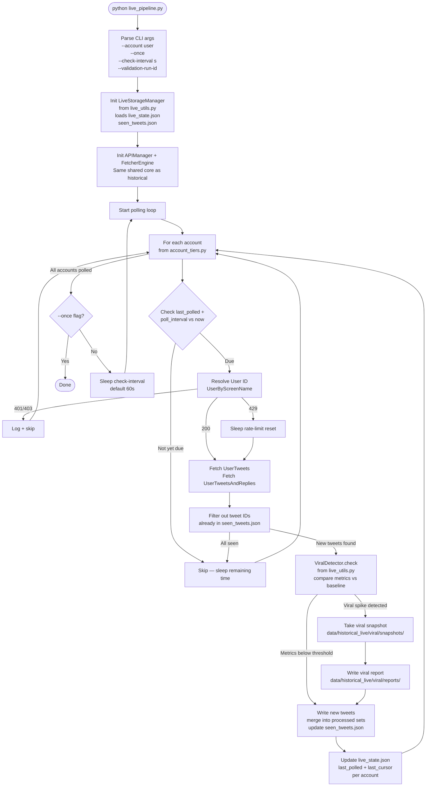
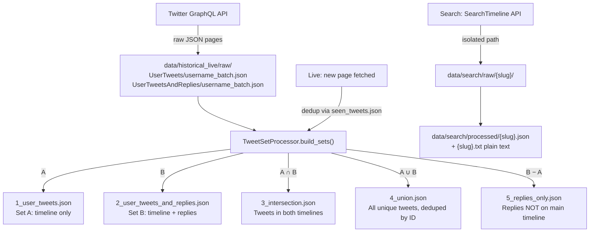

# TWEETER DATA FETCHING 4.0 — Complete Visual Guide

> Full breakdown: folder structure, every pipeline's flow, all edge cases, and the role of every supporting script.

---

## Part 1 — Folder Structure at a Glance

```
TWEETER DATA FETCHING 4.0/
│
├── 🚀 ENTRY POINTS (the scripts you actually run)
│   ├── historical_scripts/historical_pipeline.py   ← backfill tweets
│   ├── live_scripts/live_pipeline.py               ← continuous monitoring
│   └── search_scripts/search_pipeline.py           ← keyword search
│
├── 🔧 SUPPORTING SCRIPTS (live pipeline's helpers)
│   ├── live_scripts/live_utils.py                  ← state + viral detection
│
├── 🧱 SHARED INFRASTRUCTURE (used by all 3 pipelines)
│   └── shared/
│       ├── core/
│       │   ├── twitter_http_client.py    ← HTTP session, auth headers, tx-id pool
│       │   ├── pagination_engine.py      ← page fetching, cursor walking, windowing
│       │   └── tweet_processing_utils.py ← set math, window eval, GraphQL shapes
│       ├── data_pipeline/
│       │   └── storage_manager.py        ← all disk I/O, processed sets, state files
│       └── config/
│           ├── account_tiers.py          ← which accounts, at what polling speed
│           ├── config.json               ← 🔑 SECRETS: cookies, query IDs, tx-ids
│           └── search_config.json        ← search query definitions
│
├── 🔐 AUTH TOOLS (run once or on demand)
│   └── shared/auth/
│       ├── cookie_generator.py           ← interactive cookie harvest → config.json
│       ├── query_ids_updater.py          ← Playwright: refresh query-ids + tx-ids
│       ├── auto_refresh.py               ← headless Playwright: triggered on 404s
│       ├── graphql_traffic_sniffer.py    ← Selenium: capture live browser traffic
│       └── browser_context.py            ← warmup/bootstrap context helper
│
├── 🛠️ DIAGNOSTICS TOOLS (run on demand)
│   ├── tools/probe_txid.py               ← single-shot endpoint probe test
│   ├── tools/probe_sequence.py           ← sequential endpoint probe test
│   └── tools/verify_contract.py          ← validate config matches API contract
│
├── 🧪 TESTS & CAPTURE ARTIFACTS
│   ├── tests/test_graphql_contracts.py
│   ├── tests/test_runner_status.py
│   ├── tests/test_sniffer_contract.py
│   ├── tests/test_twitter_http_client.py
│   ├── tests/sniffer_runs/               ← 🔑 gitignored; live traffic captures
│   ├── tests/graphql_logs/               ← 🔑 gitignored; legacy logs
│   └── tests/probe_runs/                 ← 🔑 gitignored; probe results
│
├── 📊 KNOWLEDGE GRAPH (auto-generated)
│   └── graphify-out/                     ← regenerate: `graphify update .`
│
└── 💾 RUNTIME DATA (gitignored, generated on each run)
    └── data/
        ├── historical_live/              ← shared by historical + live
        │   ├── raw/UserTweets/
        │   ├── raw/UserTweetsAndReplies/
        │   ├── processed/1_user_tweets/
        │   ├── processed/2_user_tweets_and_replies/
        │   ├── processed/3_intersection/
        │   ├── processed/4_union/
        │   ├── processed/5_replies_only/
        │   ├── state/sync_state.json
        │   ├── state/live_state.json
        │   ├── state/seen_tweets.json
        │   └── viral/
        └── search/                       ← isolated; never creates the 5 sets
            ├── raw/{slug}/{product}/
            ├── processed/{slug}/
            └── state/search_state.json
```

---

## Part 2 — The Three Pipelines: All Paths & Edge Cases

### 🕰️ Pipeline 1: Historical (`historical_pipeline.py`)

**Purpose:** One-shot backfill of a profile's full tweet history up to a rolling date window.

```mermaid
flowchart TD
    A([python historical_pipeline.py]) --> B[Parse CLI args\n--only user\n--no-user-tweets\n--no-with-replies\n--validation-run-id]
    B --> C[Load account_tiers.py\nget ordered_accounts list]
    C --> D{Any accounts\nto process?}
    D -->|No| DONE([Done - nothing to do])
    D -->|Yes| E[Init StorageManager\nsubsystem=historical]
    E --> F[Init APIManager\nfrom config.json\nload cookies + query IDs\nload tx-id pool per endpoint]
    F --> G[Init FetcherEngine\nwraps APIManager + Storage]
    G --> H[For each account]

    H --> I[Resolve User ID\nUserByScreenName GraphQL]
    I -->|401/403\nExpired cookies| AUTH_FAIL[Log Error\nSkip account]
    I -->|429 Rate limit| SLEEP_RESET[Read x-rate-limit-reset\nSleep until reset + buffer\nRetry up to 3x]
    I -->|404 Not Found| SKIP_USER[Log: User not found\nSkip account]
    I -->|200 OK| J[Got userId]

    J --> K[Fetch UserTweets pages\nGET /graphql/{id}/UserTweets]
    K --> L{HTTP Response?}
    L -->|200 OK| M[Validate GraphQL shape\nparse instructions array]
    L -->|401/403| AUTH_FAIL
    L -->|429| SLEEP_RESET
    L -->|404 First page| STALE_QID[Log: stale query-id\nMark endpoint failed\nSkip to next endpoint]
    L -->|404 Mid-cursor| PARTIAL[Mark partial_cursor_404\nSave pages collected so far]
    
    M --> N{Tweet within\nrolling window?}
    N -->|No — window crossed| WINDOW_STOP[Stop pagination\nMark success_window_crossed]
    N -->|Yes| O{Cursor repeated\nin history?}
    O -->|Yes| LOOP_STOP[Stop: repeated_cursor_history]
    O -->|No| P[Save raw page\ndata/historical_live/raw/UserTweets/]
    P --> Q{Has bottom cursor?}
    Q -->|No cursor → end| PARTIAL
    Q -->|Yes| K

    PARTIAL --> R[Repeat for UserTweetsAndReplies\nSame flow as UserTweets]
    WINDOW_STOP --> R
    LOOP_STOP --> R

    R --> S[TweetSetProcessor\nCompute 5 sets:\nA = UserTweets\nB = UserTweetsAndReplies\nA∩B = intersection\nA∪B = union\nB-A = replies_only]
    S --> T[Write to data/historical_live/processed/\n1_user_tweets.json\n2_user_tweets_and_replies.json\n3_intersection.json\n4_union.json\n5_replies_only.json]
    T --> U[Update sync_state.json\nPer-account cursor checkpoints]
    U --> H
    H -->|All accounts done| DONE
```

**Key classes called:** `FetcherEngine` → `APIManager.perform_get()` → `StorageManager.save_raw_page()` → `TweetSetProcessor.build_sets()` → `StorageManager.merge_processed_items()`

---

### 📡 Pipeline 2: Live (`live_pipeline.py`)

**Purpose:** Continuous polling of account timelines. Detects new tweets, deduplicates, and triggers viral detection.



**Key classes:** `LiveStorageManager` (state/seen) → `FetcherEngine` → `ViralDetector` → `StorageManager.merge_processed_items()`

---

### 🔍 Pipeline 3: Search (`search_pipeline.py`)

**Purpose:** Keyword/phrase search across Twitter using `SearchTimeline`. Isolated from historical — never touches the 5 processed sets.

```mermaid
flowchart TD
    A([python search_pipeline.py]) --> B[Parse CLI args\n--only name\n--once\n--check-interval s\n--validation-run-id]
    B --> C[Load search_config.json\nFilter enabled queries]
    C --> D[Init StorageManager\nsubsystem=search\ncreate_folders=False\nmanage_sync_state=False]
    D --> E[Init APIManager\nSearchQueryBuilder]
    E --> F[Start loop over queries]

    F --> G{Last check +\nroll_interval vs now?}
    G -->|Not due| SKIP[Skip query]
    G -->|Due| H[SearchQueryBuilder\nBuild rawQuery from:\ninclude_keywords\nexclude_keywords\nexact_phrases\nfrom_account hashtags]

    H --> I[Fetch SearchTimeline\nGET /graphql/{id}/SearchTimeline\nwith rawQuery + product]
    I --> J{HTTP response?}
    J -->|401/403| AUTH_FAIL[Log + skip query]
    J -->|429| SLEEP429[Sleep x-rate-limit-reset]
    J -->|404 Initial| STALE_QUERY[Log: bad query or stale ID\nSkip query]
    J -->|404 Cursor| SAVE_PARTIAL[Save pages collected so far]
    J -->|200| K[Validate GraphQL shape\nextract tweets + next cursor]

    K --> L{Tweet timestamp\nwithin rolling_hours?}
    L -->|Outside window| SAVE_PARTIAL
    L -->|Inside window| M[Save raw page\ndata/search/raw/slug/product/batch/\npage_N.json]
    M --> N{Has bottom cursor?}
    N -->|No| SAVE_PARTIAL
    N -->|Yes| I

    SAVE_PARTIAL --> O[Save debug page\ndata/search/debug/\nfirst page entry type counts]
    O --> P[Build processed output\n.json + .txt per query]
    P --> Q[Save to data/search/processed/\nslug/product/slug.json\nslug/product/slug.txt]
    Q --> R[Update search_state.json\nlast_check + tweet count]
    R --> F

    F -->|All queries done| S{--once flag?}
    S -->|Yes| DONE([Done])
    S -->|No| T[Sleep check-interval]
    T --> F

    SKIP --> F
    AUTH_FAIL --> F
    STALE_QUERY --> F
    SLEEP429 --> I
```

**Key classes:** `SearchTimelineMonitor` → `SearchQueryBuilder` → `APIManager.perform_get()` → `StorageManager.save_search_result_page()`

---

## Part 3 — The Auth & Auto-Refresh System

This is the glue that keeps all three pipelines alive when Twitter rotates credentials.

```mermaid
flowchart LR
    subgraph Normal Operation
        A[APIManager.perform_get] --> B{HTTP 404?}
        B -->|No| C[Return response]
        B -->|Yes| D[Mark tx-id stale\nin tx_id_state.json]
        D --> E{All tx-ids\nfor this endpoint stale\nAND 3 consecutive 404s?}
        E -->|No| F[Rotate to next\nhealthy tx-id\nRetry]
        E -->|Yes| G
    end

    subgraph auto_refresh.py — Headless Playwright
        G([Trigger auto_refresh]) --> H[Launch headless Chromium\nLoad cookies from config.json]
        H --> I[Navigate: profile page\n3 scrolls → capture UserTweets tx-ids]
        I --> J[Navigate: /with_replies\n3 scrolls → capture UserTweetsAndReplies tx-ids]
        J --> K[Navigate: search page\n3 scrolls → capture SearchTimeline tx-ids]
        K --> L[Extract tx-ids by endpoint\nUpdate config.json atomically]
        L --> M[Reload config in main thread\nReset all stale flags]
        M --> N[Retry original request\nwith fresh tx-id]
    end
```

---

## Part 4 — The Supporting Tool Scripts

### `shared/auth/cookie_generator.py` — Cookie Setup
Run **once** when your session expires.
```
python shared/auth/cookie_generator.py
```
- Prompts you for cookies from browser DevTools
- Writes `auth_token`, `ct0`, `guest_id`, `kdt`, `twid` into `config.json`
- **Trigger:** you see HTTP 401/403 errors

### `shared/auth/query_ids_updater.py` — Query ID + TX-ID Refresh
Run **when Twitter rotates its GraphQL query IDs** (you'll see 400 errors).
```
python shared/auth/query_ids_updater.py
```
- Opens interactive Playwright browser
- Navigates Twitter, intercepts GraphQL requests
- Updates `api_config.{endpoint}_query_id` in `config.json`
- Also captures a fresh batch of tx-ids per endpoint
- **Trigger:** HTTP 400 errors that don't go away

### `shared/auth/graphql_traffic_sniffer.py` — Live Traffic Capture
Run **to reverse-engineer Twitter's current request shape**.
```
python -m shared.auth.graphql_traffic_sniffer elonmusk --timeout 120
```
- Opens a **headful** Chrome browser via Selenium
- Injects a JS interceptor *before* page scripts run
- Captures every GraphQL request + response (including `x-client-transaction-id`)
- Writes to `tests/sniffer_runs/{jalali_batch}/`: `timeline.jsonl`, `timeline.html`, `contract.json`, `playbook.md`
- **Read-only**: never modifies `config.json`

### `tools/probe_txid.py` — Quick Endpoint Health Check
Run **after any auth change** to verify all 3 endpoints are responding.
```
python tools/probe_txid.py
```
- Fires one request at each of: `UserTweets`, `UserTweetsAndReplies`, `SearchTimeline`
- Reports HTTP status + rate-limit remaining
- Saves timestamped results to `tests/probe_runs/{timestamp}/`

### `tools/probe_sequence.py` — Sequential Endpoint Test
Run **to check if endpoints must be called in a specific order**.
```
python tools/probe_sequence.py
```
- Tests whether calling `UserTweets` before `UserTweetsAndReplies` matters
- Evidence: ordering is **not** required

### `tools/verify_contract.py` — Contract Validation
Run **to confirm config.json query IDs match known-good values**.
```
python tools/verify_contract.py
```
- Compares current `config.json` query IDs vs `shared/config/known_good_contracts/`
- Flags drift before it causes 400 errors in production

### `shared/tools/diagnostics_tool.py` — Reply Set Diagnostics
Run **when you suspect something is wrong with the replies-only set**.
```
python shared/tools/diagnostics_tool.py
```
- Checks whether `5_replies_only.json` correctly equals B − A
- Explains any mismatches in plain English

---

## Part 5 — The Data Flow: What Happens to Your Tweets



---

## Part 6 — State Files: Who Reads/Writes What

| State File | Location | Written By | Read By | Purpose |
|---|---|---|---|---|
| `sync_state.json` | `data/historical_live/state/` | `StorageManager` | Historical pipeline | Last cursor per account+endpoint |
| `live_state.json` | `data/historical_live/state/` | `LiveStorageManager` | Live pipeline | Last poll time + cursor per account |
| `seen_tweets.json` | `data/historical_live/state/` | `LiveStorageManager` | Live pipeline | Tweet ID dedup set |
| `snapshot_index.json` | `data/historical_live/state/` | `LiveStorageManager` | Live pipeline | Index of viral snapshots |
| `tx_id_state.json` | `data/historical_live/state/` | `APIManager` | `auto_refresh.py` | Health status of tx-ids per endpoint |
| `search_state.json` | `data/search/state/` | `SearchTimelineMonitor` | Search pipeline | Last check time + tweet count per query |
| `config.json` | `shared/config/` | `cookie_generator.py`, `query_ids_updater.py`, `auto_refresh.py` | All pipelines | 🔑 Cookies, query IDs, tx-id pools |

---

## Part 7 — The HTTP Error Decision Table

Every single `perform_get()` call in all three pipelines follows this exact table:

| HTTP Code | Meaning | Action |
|---|---|---|
| **200** | Success | Validate GraphQL shape. If `errors` key present or data path is null → treat as failure. |
| **400** | Bad request shape | Query ID wrong, variables/features/fieldToggles mismatch. **Do not retry**. Compare against `contract.json`. |
| **401** / **403** | Auth failure | Cookies expired or `x-csrf-token ≠ ct0`. Run `cookie_generator.py`. |
| **404 (first page)** | Route rejected | Stale query ID, bad context. `auto_refresh.py` triggered if tx-ids are all stale. |
| **404 (mid-cursor)** | Cursor invalid | Cursor is dead. Save collected pages, mark `partial_cursor_404`, stop chain. |
| **429** | Rate limited | Read `x-rate-limit-reset` header. Sleep until that epoch + buffer. Retry same request. |

---

## What Was Done in This Session

| Task | Status |
|---|---|
| Added Mermaid pipeline diagrams to `AGENTS.md` | ✅ |
| Added `selenium` to `requirements.txt` | ✅ |
| Merged V4 `.gitignore` rules into root `.gitignore` | ✅ |
| Added `tests/probe_runs/` to root `.gitignore` | ✅ |
| Updated graphify at both root and V4 level | ✅ |
| Updated `AGENTS.md` with new file tree and V4 consolidation notes | ✅ |
| Updated `README.md` with correct file names and auto-refresh section | ✅ |
| Generated this complete visual guide | ✅ |
