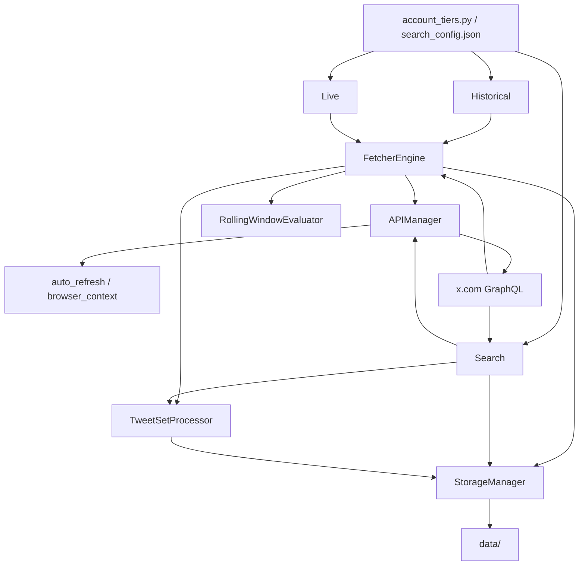
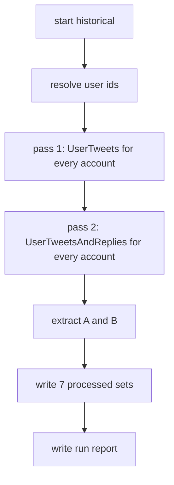
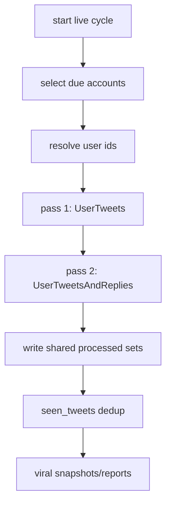
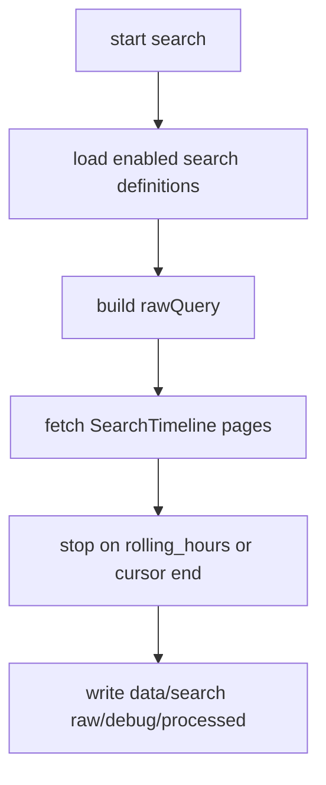
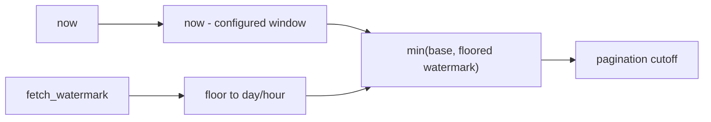
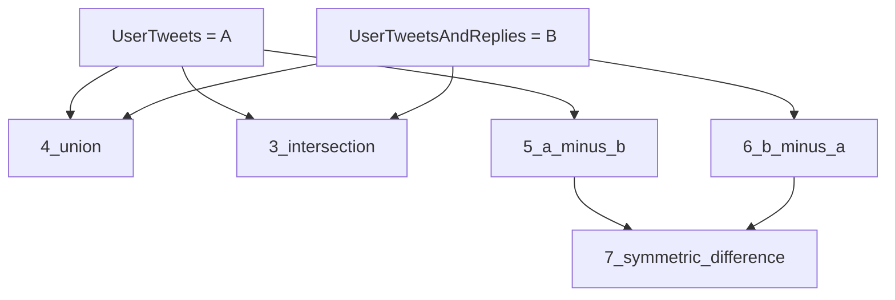
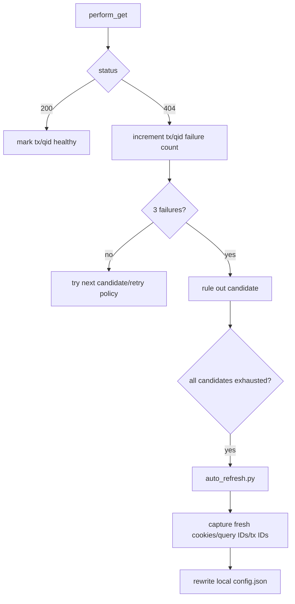

# TWEETER DATA FETCHER — Visual Guide

This is the map view of the current root-level `src/` project.

## File Tree

```text
.
  README.md
  AGENTS.md
  project_visual_guide.md
  pyproject.toml
  requirements.txt
  src/
    pipelines/
      historical/fetch_historical.py
      live/monitor_live.py
      live/utils.py
      search/search_timeline.py
    shared/
      auth/auto_refresh.py
      auth/browser_context.py
      config/account_tiers.py
      config/config.example.json
      config/search_config.json
      core/pagination_engine.py
      core/tweet_processing_utils.py
      core/twitter_http_client.py
      data_pipeline/storage_manager.py
  diagnostics/
    probe_sequence.py
    probe_txid.py
    traffic_sniffer.py
    verify_contract.py
  tests/
    unit/
    integration/
    contract/
  tools/
    parity_check.py
```

Ignored local/generated paths:

```text
src/shared/config/config.json
data/
diagnostics/probe_runs/
diagnostics/sniffer_runs/
diagnostics/graphql_logs/
graphify-out/
```

## System Flow



## Historical Pipeline



Important stops:

- Stops pagination when the oldest seen tweet is at or before the absolute cutoff.
- Advances `fetch_watermark` only on completed endpoint fetches.
- Saves partial pages on cursor 404 or rate-limit exhaustion.

## Live Pipeline



Live no longer post-filters tweets by a separate UTC window. It uses the same cutoff stop as historical, with hour-level watermark flooring.

## Search Pipeline



Search stays isolated under `data/search/`.

## Watermark Window



Historical floor: day. Live floor: hour.

## Output Sets



Folders:

- `1_user_tweets`: A
- `2_user_tweets_and_replies`: B
- `3_intersection`: A intersect B
- `4_union`: A union B
- `5_a_minus_b`: A minus B
- `6_b_minus_a`: B minus A
- `7_symmetric_difference`: A symmetric difference B

## Auth And Param Refresh



## Data State

| File | Purpose |
|---|---|
| `sync_state.json` | Historical/live endpoint cursor, status, watermark, raw batch path. |
| `live_state.json` | Live account poll status. |
| `seen_tweets.json` | Cross-run live tweet dedup. |
| `snapshot_index.json` | Viral snapshot lookup. |
| `tx_id_state.json` | Transaction ID health/failure count. |
| `query_id_state.json` | Query ID health/failure count. |
| `rate_limits.json` | Persisted endpoint reset/remaining counters. |
| `search_state.json` | Search query run state. |

## Verification Map

```text
tests/unit/test_unified_historical_live_plan.py
  rolling cutoff
  watermark flooring
  seven set math
  three-strike param state
  3600s rate cap

tests/integration/
  historical pipeline
  live pipeline
  search pipeline

tests/contract/
  sniffer and GraphQL contract expectations
```

Run:

```bash
.venv/bin/python -m pytest -q
python -m compileall -q src tests
graphify update .
```
