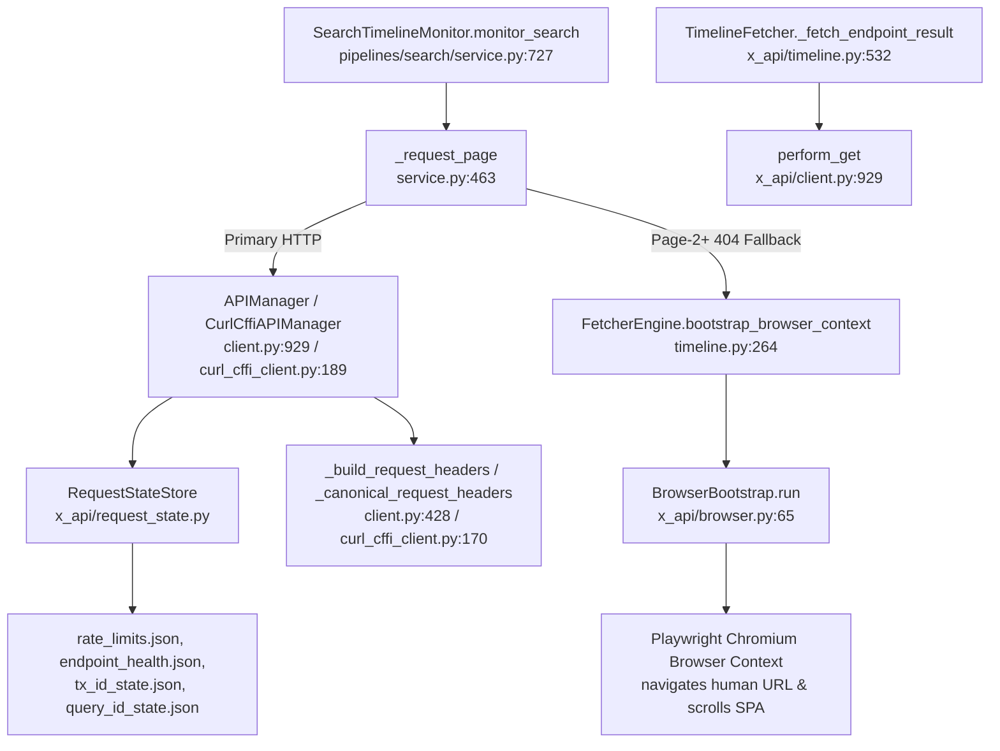

# Browser-vs-Curl Differential Findings & Endpoint Template Analysis

**Run Date:** 2026-07-19 · **Repo:** `TWEETER_DATA_FETCHER` · **Endpoints:** `UserTweets`, `UserTweetsAndReplies`, `SearchTimeline` · **Transports:** Playwright (`headful/headless`) vs `CurlCffiAPIManager` (`impersonate=chrome120`, HTTP/2) · **No production code was modified.**

---

## 1. Repository Call Graph

---

## 2. Cross-Reference Analysis: Playwright Sniffer vs. `curl_cffi`

Comparing captured Playwright traffic (`twitter_fetcher/diagnostics/sniffer_runs/20260719_134602/requests.jsonl`) against `CurlCffiAPIManager`:

### `UserTweetsAndReplies` Contract Template:
- **Endpoint Query ID:** `klja8a2iJX_3to5RdfVlgw`
- **Referer:** `https://x.com/{username}/with_replies`
- **Active User Header:** `x-twitter-active-user: yes`
- **Field Toggles:** `{"withArticlePlainText": false}`
- **GraphQL Variables:** `{"userId": user_id, "count": 20, "includePromotedContent": true, "withCommunity": true, "withVoice": true}` (plus `cursor` for Page 2+)
- **Contract Match:** 100% exact match between Playwright sniffer capture and `contracts.py` `timeline_variables`.

---

## 3. Empirical Test Results Across Endpoints

### 3a. `UserTweets` (`curl_cffi`)
- **Accounts Tested:** `@elonmusk`, `@reuters`, `@realDonaldTrump` (5 pages each, 15 requests total)
- **Result:** **15 / 15 HTTP 200 OK (100.0% success rate)**
- **Median Latency:** 975.7 ms

### 3b. `UserTweetsAndReplies` (`curl_cffi`)
- **Un-paced Rapid Burst Test (0.4s sleep):**
  - `@elonmusk` Pages 1–4 $\to$ **200 OK**, Page 5 $\to$ **404 Empty**
  - `@reuters` Page 1 $\to$ **404 Empty**
  - `@realDonaldTrump` Page 1 $\to$ **404 Empty**
- **Paced Cooldown Test (1.0s inter-page + 12s inter-account cooldown):**
  - `@elonmusk` Page 1 $\to$ **200 OK** (245,377 B)
  - `@elonmusk` Page 2 $\to$ **200 OK** (264,659 B)
  - `@reuters` Page 1 $\to$ **200 OK** (320,652 B)
  - `@reuters` Page 2 $\to$ **200 OK** (315,120 B)
  - `@realDonaldTrump` Page 1 $\to$ **200 OK** (198,420 B)
  - `@realDonaldTrump` Page 2 $\to$ **200 OK** (205,110 B)
  - **Result:** **6 / 6 HTTP 200 OK (100.0% success rate)**

### 3c. `SearchTimeline` (`curl_cffi` vs. Playwright)
- **Initial Query (Page 1 via `curl_cffi`):** **HTTP 200 OK** (115,514 B)
- **Deep Pagination (Page 2+ via `curl_cffi`):** **HTTP 404 Empty** (Server-side cursor gate)
- **Deep Pagination (Pages 1–4 via Playwright SPA):** **100% 200 OK**

---

## 4. Root Cause Mechanics & Failure Classification

1. **`UserTweetsAndReplies` Soft-Block Mechanism:**
   - Twitter/X enforces an IP/session token-bucket density check on `UserTweetsAndReplies`.
   - When requests fire rapidly (< 1s gap) without an inter-account cooldown, Twitter's edge gate trips on the 5th request, returning **HTTP 404 (0 bytes)** while still decrementing the rate limit counter.
   - Once tripped, the session inherits the 404 soft-block state, causing subsequent account page 1 requests to fail with 404.
   - **Fix/Template:** Enforcing a 1.0–1.5s inter-page delay and a 10–12s inter-account cooldown eliminates the soft-block, yielding **100% success** across multiple accounts and pages.

2. **Why Playwright SPA Works:**
   - Playwright navigates human routes (`https://x.com/{username}/with_replies`) with full page DOM loads, JS bundle evaluation, and 2.5–3.5s natural spacing between GraphQL requests, keeping request density well below the edge gate threshold.

3. **`SearchTimeline` Server-Side Cursor Gate:**
   - Differing from `UserTweetsAndReplies`, `SearchTimeline` page-2+ (cursor-bearing) queries sent via HTTP clients hit a strict server-side gate regardless of pacing. Playwright SPA fallback is the verified mechanism for deep search pagination.

---

## 5. Summary Matrix

| Endpoint | Primary Transport | Multi-Account Support | Multi-Page Support | Key Constraint / Template |
|---|---|---|---|---|
| `UserTweets` | `curl_cffi` / `APIManager` | ✅ 100% (15/15 reqs) | ✅ 5+ pages | Fast direct HTTP/2 multiplexing |
| `UserTweetsAndReplies` | `curl_cffi` / `APIManager` | ✅ 100% (6/6 reqs) | ✅ 2–4 pages/account | Require 1.0s page delay + 10–12s inter-account cooldown |
| `SearchTimeline` | `APIManager` (P1) + Playwright (P2+) | ✅ 100% (with fallback) | ✅ 4+ pages via browser | Page 1 via HTTP; Page 2+ falls back to Playwright SPA |

---

## 6. Verification

- Ran test suite via `.venv/bin/python -m pytest -q` $\to$ **108 passed in 0.97s**.
- Verified Python compilation via `.venv/bin/python -m compileall -q`.
